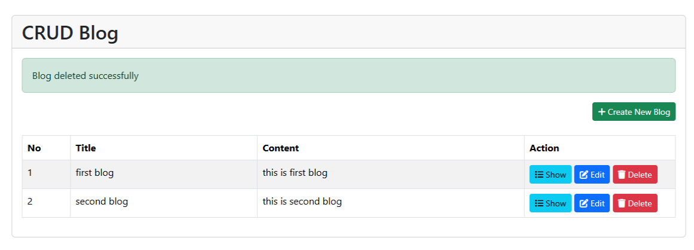
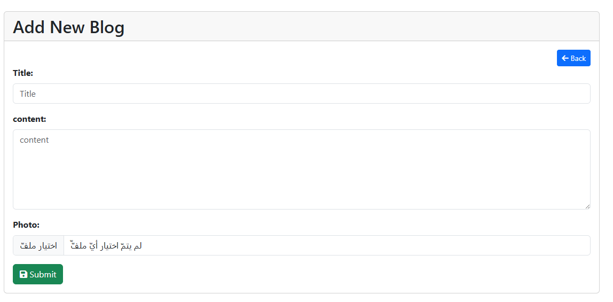

# Blog CRUD (Laravel Blade)

Blog CRUD is a simple blog management system built with **Laravel 12**, allowing users to manage blogs (CRUD) with image uploads.  
It includes **Blade templates** for creating, editing, listing, and showing blogs.

---

## Table of Contents

-   [Project Overview](#project-overview)
-   [Tech Stack](#tech-stack)
-   [Requirements](#requirements)
-   [Installation & Setup](#installation--setup)
-   [Database Structure](#database-structure)
-   [Routes & Blade Views](#routes--blade-views)
-   [Features](#features)
-   [Screenshots](#screenshots)

---

## Project Overview

Blog CRUD allows users to:

-   Create, read, update, and delete blogs.
-   Upload a photo for each blog.
-   Filter blogs by title.
-   Use Blade templates for web UI (**index, create, edit, show**).

---

## Tech Stack

| Component       | Technology   |
| --------------- | ------------ |
| Framework       | Laravel 12.x |
| Language        | PHP ^8.2     |
| Database        | MySQL        |
| Templating      | Blade        |
| Package Manager | Composer     |
| Testing         | PHPUnit      |

---

## Requirements

| Component | Version |
| --------- | ------- |
| PHP       | ≥ 8.2   |
| Composer  | Latest  |
| Laravel   | 12.x    |
| Database  | MySQL   |

---

## Installation & Setup

1. **Clone the Repository**

    ```bash
    git clone <your-repo-url>
    cd blog-crud
    ```

2. **Install Dependencies**

    ```bash
    composer install
    ```

3. **Configure Environment**

    ```bash
    cp .env.example .env
    php artisan key:generate
    ```

    ثم اضبط إعدادات قاعدة البيانات في ملف `.env`.

4. **Set Up the Database**

    ```bash
    php artisan migrate --seed
    ```

5. **Run the Application**
    ```bash
    php artisan serve
    ```

---

## Database Structure

### Users Table

| Column   | Type   | Description          |
| -------- | ------ | -------------------- |
| id       | bigint | Primary key          |
| name     | string | User's name          |
| email    | string | User's email         |
| password | string | Hashed password      |
| avatar   | string | User avatar filename |

### Blogs Table

| Column     | Type      | Description                   |
| ---------- | --------- | ----------------------------- |
| id         | bigint    | Primary key                   |
| title      | string    | Blog title                    |
| content    | text      | Blog content                  |
| photo      | string    | Blog photo filename           |
| user_id    | bigint    | Foreign key referencing users |
| created_at | timestamp | Blog creation timestamp       |
| updated_at | timestamp | Blog last update timestamp    |

---

## Routes & Blade Views

| Route            | Method | Description                | Blade View       |
| ---------------- | ------ | -------------------------- | ---------------- |
| /blogs           | GET    | List all blogs             | index.blade.php  |
| /blogs/create    | GET    | Show form to create a blog | create.blade.php |
| /blogs           | POST   | Store a new blog           | N/A              |
| /blogs/{id}      | GET    | Show a specific blog       | show.blade.php   |
| /blogs/{id}/edit | GET    | Show form to edit a blog   | edit.blade.php   |
| /blogs/{id}      | PUT    | Update a blog              | N/A              |
| /blogs/{id}      | DELETE | Delete a blog              | N/A              |

---

## Features

-   **CRUD Operations**: Full create, read, update, and delete functionality.
-   **File Upload**: Upload a photo for each blog.
-   **Filtering**: Search blogs by title.
-   **Blade Templates**: Clean web interface using Laravel Blade.

---

## Screenshots




---
